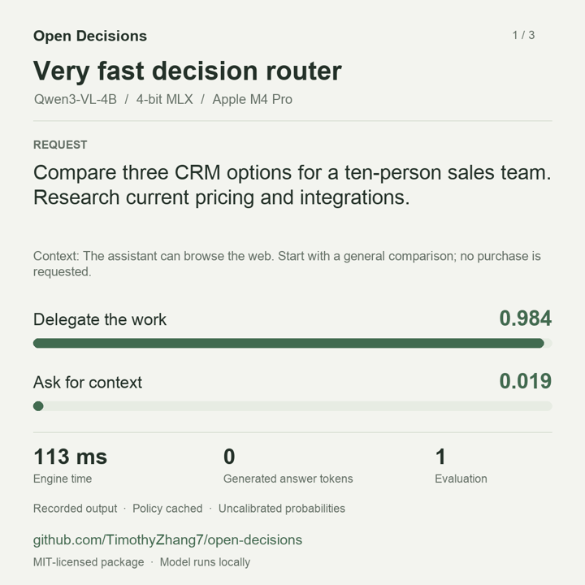
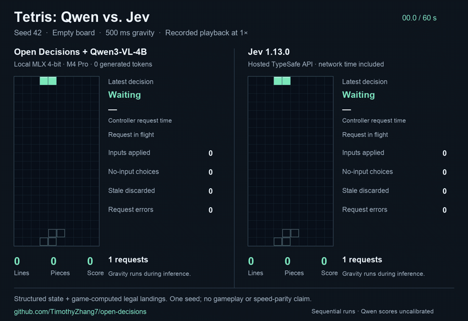

# Open Decisions

An open-source package for Jev-style typed decisions on open models. Supply application state and questions; get choices, yes/no probabilities, scores, or multiple gates. The package reads the model's next-token label logits and generates no answer tokens.

The core is independent of any model or runtime. Qwen3-VL-4B is one supported backend. Applications own their workflows; backend adapters own inference. This is an independent implementation of the programming pattern, with stock model weights and uncalibrated probabilities.

[Install](#install) · [Python SDK](#python-sdk) · [Run locally](#run-the-examples) · [Limitations](#limitations) · [Development updates on X](https://x.com/TimothyZ77)

## Demos

### Agent routing

Qwen3-VL-4B returns two probabilities in one evaluation: whether to delegate the work and whether to ask for missing context.

[](https://github.com/TimothyZhang7/open-decisions/releases/download/demo-2026-09-18/open-decisions-launch.mp4)

[Watch / download the 28-second clip](https://github.com/TimothyZhang7/open-decisions/releases/download/demo-2026-09-18/open-decisions-launch.mp4) · [Recorded inputs and outputs](docs/media/router-results.json)

These are recorded model outputs, held on screen for readability. The model was already loaded. Engine times were 533 ms with an uncached policy, then 113 ms and 118 ms with the policy cached. Zero answer tokens were generated; model inference still ran.

### Tetris: Qwen vs. Jev

One 60-second run per backend, with seed 42, an empty board, the same piece sequence, 500 ms gravity, and the same controller. Playback is synchronized by elapsed time; the runs were recorded separately.

[](https://github.com/TimothyZhang7/open-decisions/releases/download/demo-2026-09-18/tetris-qwen-vs-jev.mp4)

[Watch / download the comparison](https://github.com/TimothyZhang7/open-decisions/releases/download/demo-2026-09-18/tetris-qwen-vs-jev.mp4) · [Method and limitations](examples/tetris/COMPARISON.md) · [Run the example](examples/tetris/README.md)

| Observed result | Qwen3-VL-4B, local MLX 4-bit | Jev 1.13.0, hosted API |
| --- | ---: | ---: |
| Lines cleared | **0** | **0** |
| Pieces locked | 6 | 6 |
| Median controller request time | 419 ms | 135 ms |
| Failed requests | 0 | 1 connection failure |
| Stale responses discarded | 4 | 1 |

**Tetris is an experimental integration example. Neither run reached the 10-line goal.** The models receive structured board state and game-computed legal landings, projected outcomes, and distances to the target. This evaluates choices within that supplied controller. It does not test playing from screenshots, learning the rules, or general game-playing ability. Jev's request time includes network access; Qwen runs locally. One short run does not establish a reliable quality or speed ranking.

## Limitations

- **Probabilities are uncalibrated.** A high score can be wrong. The saved Qwen vision checks include a confident image-ordering error. Distribution concentration is not a correctness guarantee.
- **Stock models and an independent interface.** This package implements the decision pattern. It does not reproduce Jev's training or claim matching quality, calibration, or speed.
- **Zero generated tokens still requires inference.** Input length, image processing, model size, cache use, and hardware determine cost and latency. Multiple questions are evaluated serially; joint `Gates` use one evaluation.
- **Small evaluations.** The 27/28 synthetic smoke result and these demos are implementation checks. They do not establish production accuracy or long-run agent reliability.
- **Tetris receives substantial help from code.** The controller enumerates and evaluates legal landings, maintains targets, and supplies movement distances. Model choices can still be poor or arrive too late while gravity continues.
- **Backend coverage is partial.** The MLX vision adapter currently targets Qwen3-VL. Transformers vision and CUDA/MPS execution remain unverified here.

See [EVALUATION.md](EVALUATION.md) for measurements and recorded failures.

## Decision primitives

| Primitive | Meaning | Result |
| --- | --- | --- |
| `Choice` | Select one of the supplied options | Winning key, distribution, concentration |
| `Noul` | Decide whether a condition holds | Probability of yes, from 0 to 1 |
| `Score` | Place evidence on an ordered rubric | Probability-weighted level and normalized score |
| `Gates` | Judge up to four booleans together | Joint distribution and per-gate probabilities |

Choice, Noul, and Score follow the general shapes described in [TypeSafe's documentation](https://docs.typesafe.ai/primitives/choice). The API is project-specific, not a drop-in TypeSafe server. Gates is an extension for coupled decisions such as delegate/ask.

## Install

Python 3.11 or newer. Install the core and the runtime you need from this source checkout:

```sh
git clone https://github.com/TimothyZhang7/open-decisions.git
cd open-decisions

# Apple Silicon, vision and text runtimes, API, and tests
uv sync --extra mlx-vlm --extra mlx-lm --extra server --extra dev

# Or a PyTorch setup (CPU/CUDA/MPS)
uv sync --extra transformers --extra server --extra dev
```

With pip: `python -m pip install -e '.[mlx-vlm,server]'` or `'.[transformers,server]'` inside a virtual environment. Core-only consumers can install with `python -m pip install .` and use the HTTP client or provide a custom backend. The package is distributed through GitHub; it has not been published to PyPI.

| Backend | Model support | Verified locally |
| --- | --- | --- |
| `mlx-vlm` | Qwen3-VL family; text and images | Qwen3-VL-4B-Instruct, MLX 4-bit |
| `mlx-lm` | Instruction-tuned text models with the MLX-LM forward/cache interface | Qwen3-4B-Instruct-2507, MLX 4-bit |
| `transformers` | Standard Hugging Face causal models | SmolLM2-135M-Instruct on CPU |
| Custom | Implement the small backend protocol | Tested through a custom backend factory |

The Transformers adapter also has an experimental `vision=True` path through `AutoModelForImageTextToText`; that path and CUDA/MPS execution have not been exercised here. Each model needs a chat template and at least two usable single-token answer labels. Model support in an underlying runtime does not establish decision quality. Model-specific restrictions fail explicitly.

## Python SDK

```python
from open_decisions import LocalClient, Choice, Noul, Score

with LocalClient(
    "mlx-community/Qwen3-VL-4B-Instruct-4bit",
    backend="mlx-vlm",
    backend_options={"revision": "2fd8dacbdb8f1e54b8c005f081ec5bf79c56376b"},
) as client:
    result = client.evaluate(
        state="I was charged twice. Please refund the duplicate payment.",
        questions={
            "team": Choice(
                instructions="Which team handles this request?",
                criteria={"billing": "Payments and refunds", "technical": "Software errors"},
            ),
            "refund": Noul(instructions="Does the customer request a refund?"),
            "urgency": Score(
                instructions="How urgently should this be handled?",
                criteria=["Routine", "Needs attention today", "Immediate response needed"],
            ),
        },
    )
    print(result.answers["team"].choice)
    print(result.answers["refund"].noul)
    print(result.usage.output_tokens)  # 0
```

Choose another model by changing the client configuration; questions and application code stay the same:

```python
client = LocalClient("path/to/any-supported-mlx-text-model", backend="mlx-lm")

client = LocalClient(
    "HuggingFaceTB/SmolLM2-135M-Instruct",
    backend="transformers",
    backend_options={"device": "cpu"},
)
```

Keep the client alive to reuse the loaded model and supported caches. Close it when done. Multiple questions return in one response but are evaluated separately and serially. They cannot see one another's answers. For two gates in one model evaluation, use `Gates`.

### Joint gates

```python
from open_decisions import Gates

result = client.evaluate(
    state={"request": "Book it for me.", "context": "No earlier messages."},
    questions={"routing": Gates(
        instructions=(
            "Ask for essential missing context when it cannot be inferred or retrieved. "
            "Asking is a direct response. Otherwise delegate work taking more than "
            "a couple of fast tool calls or a few seconds. Handle short replies directly."
        ),
        criteria={
            "delegate": "The assistant should delegate the work now.",
            "ask": "The assistant must ask the user for essential missing context first.",
        },
    )},
)
print(result.answers["routing"].gates)
assert result.usage.model_evaluations == 1
```

Two gates compile into four outcomes: `00`, `01`, `10`, `11`, in criteria order. One label is assigned to each outcome. The package sums probabilities where each gate is true to obtain its marginal. All combinations are preserved; your policy and application determine precedence and thresholds. Gates are coupled judgments and can differ from separately prompted Nouls.

### Images

```python
from open_decisions import ImageInput, Choice

result = client.evaluate(
    state="Use the attached image.",
    images=[ImageInput.from_file("examples/fixtures/red.png")],
    questions={"shape": Choice(
        instructions="What shape is shown?",
        criteria={"circle": "Circle", "square": "Square", "triangle": "Triangle"},
    )},
)
```

Use an image-capable backend. Images are EXIF-corrected and resized to fit 1024×1024. The API accepts PNG, JPEG, and WebP data URLs, with no remote fetches or server file paths. Model vision features are used directly; images are not converted into a text-only summary. Fine detail can be lost during resizing. Image encoding is currently repeated per question.

## Run the examples

Download the pinned Qwen vision weights once (about 2.9 GiB):

```sh
uv run open-decisions download mlx-community/Qwen3-VL-4B-Instruct-4bit \
  --revision 2fd8dacbdb8f1e54b8c005f081ec5bf79c56376b \
  --directory .models/qwen3-vl-4b-instruct-4bit

uv run python examples/router/app.py \
  --backend mlx-vlm --model .models/qwen3-vl-4b-instruct-4bit
```

Router: **http://127.0.0.1:8772/**. It shows both routing gates, timing, cache use, and raw label logits. It also includes Choice/Noul/Score and image input examples.

```sh
uv run python examples/tetris/server.py \
  --backend mlx-vlm --model .models/qwen3-vl-4b-instruct-4bit
```

Tetris: **http://127.0.0.1:8773/**. The game enumerates legal landings, asks a `Choice` for a target, then uses another `Choice` for each movement. Gravity and collision rules stay in the game. The selected target persists across inputs. It is an integration example, not evidence of strong game-playing ability. Both demos accept `--backend` and `--model`; older demos remain separate.

## HTTP service

```sh
uv run open-decisions serve --backend mlx-vlm \
  --model .models/qwen3-vl-4b-instruct-4bit --port 8772

curl http://127.0.0.1:8772/v1/evaluate \
  -H 'Content-Type: application/json' --data-binary @examples/router.json
```

The standalone service exposes `/v1/evaluate`, `/health`, `/api/info`, `/docs`, and `/openapi.json`. It has no browser demo at `/`; examples mount their own UI. To use it from Python, substitute `Client("http://127.0.0.1:8772")` for `LocalClient(...)`.

The server loads one chosen model. It returns 429 while a decision is running; health stays responsive. Disconnecting a browser does not cancel in-flight GPU work. Services default to loopback and have no login. Local model paths allow offline inference after installation/download.

Limits: 16 questions; at most 255 Choice options (tokenizer capacity may be lower); 2–10 Score levels; 1–4 Gates; four images ≤4 MiB and ≤16 MP each; 24 MiB request body; 64 KB state and policy per question; default 8192 prompt tokens after image expansion. Unsupported inputs are rejected rather than truncated. Unknown request fields return 422.

## Add a backend

A backend exposes `model_id`, `name`, `labels`, `capabilities`, and `score(system, state, images, count) -> LogitResult`. It receives a compiled policy and state and returns logits for the first `count` labels. The core handles all result semantics. Implementations must score exactly the requested labels, avoid generating tokens, and report actual token/cache use.

```python
from open_decisions import LocalClient

client = LocalClient(backend_factory=lambda: MyBackend("my-open-model"))
```

The factory and all its inference run on the client's dedicated thread. No changes to the core, server, or demos are required. See [the protocol](src/open_decisions/backends/base.py) and [extension test](tests/test_backends.py).

## Probability semantics

The package prefills the input and reads the standard LM head at the next answer position. It computes `softmax(allowed_logits / temperature)` and builds the typed response in Python. It does not sample or decode a token, parse model-written JSON, or use a separately trained decision head. Zero generated tokens still requires model inference.

- `Choice.choice` is the highest-probability key.
- `Noul.noul` is the probability assigned to the yes label.
- `Score.score = sum(index * probability)`, from 0 to N−1. `normalized_score` divides by N−1.
- `confidence = 1 − H(p)/log(N)` describes distribution concentration, with 1 for one option.
- `traces.label_mass` reports the original vocabulary probability held by the allowed labels before temperature and renormalization.

Scores are uncalibrated. A confident wrong answer is possible and appears in the saved evaluations. Model choice, prompt wording, option order, precision, and temperature affect them. Changing temperature alone is not calibration. Validate application thresholds on held-out task data. No Jev quality, calibration, or speed parity is claimed.

MLX backends reuse immutable copies of cached static policies (LRU: eight policies, 4096 total cached tokens, 2048 per policy). Current state and images never extend the stored cache. The Transformers adapter performs a fresh prefill. Input usage sums full prompt tokens across questions; processed tokens exclude actual cache hits; image tokens are a subset of input tokens. Model evaluations count output distributions, not decoder calls used to build a cache.

## Tests and measured results

The reusable package is under `src/open_decisions/`; model adapters are under `backends/`. Both applications import the public SDK. Neither example implements model loading, tokenization, or logit extraction.

```sh
uv run pytest -q
node examples/tetris/test_tetris_ui.cjs
uv run python examples/evaluate_model.py --model .models/qwen3-vl-4b-instruct-4bit
uv build
```

See [EVALUATION.md](EVALUATION.md) for real backend checks, smoke results, and known failures. Runtime versions are pinned where adapter internals are used. Model-independent tests run without weights, MLX, or PyTorch.

## License

Code and generated fixtures: [MIT](LICENSE). Model weights are downloaded separately under their original licenses. See [THIRD_PARTY.md](THIRD_PARTY.md). This project is independent of TypeSafe, Qwen, and the model/runtime authors.
